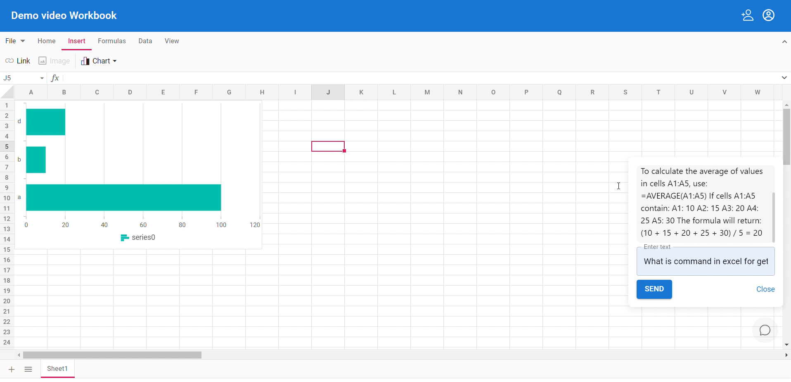
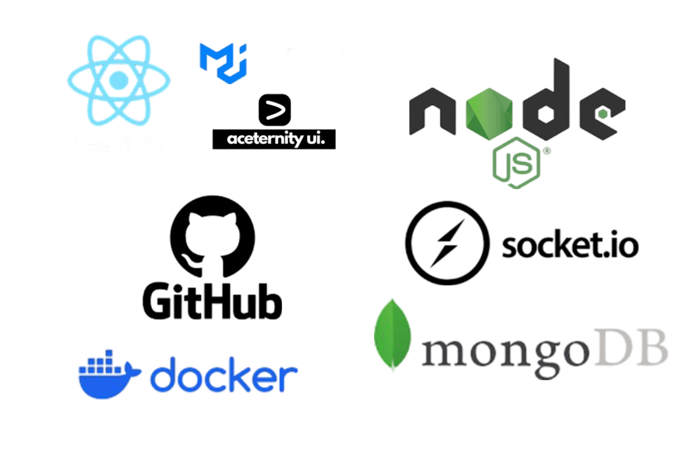

# Project Title: Geass Sheet

### **Team Name:** Code Geass

## Team Details

- **Team Leader**: Manas Pratim Das ([GitHub](https://github.com/2manas8))
- **Team Members**:
  - Aditya ([GitHub](https://github.com/adityasabkb))
  - Prasun Sharma ([GitHub](https://github.com/Pruhsoon))
  - Shiksha Nath ([GitHub](https://github.com/shiksha-nath))
  - Tarun P ([GitHub](https://github.com/Tarun2605))
  - Vanshika Goel ([GitHub](https://github.com/vanshugoel))

## Project Description

We developed a new version of **SocialCalc** using **Node.js and ReactJs**. This update modernized the underlying technology, enhancing performance, security, and alignment with current web development standards. Our project retained the core functionalities of SocialCalc while introducing new features such as real-time collaboration and a more intuitive user experience. We focused on making the application robust and feature-rich to meet today’s user needs. Key features include:

- AI-driven support system to assist with solving doubts and answering questions in real-time
- Real-time collaboration
- Enhanced performance and security
- Intuitive user interface for improved experience
- Modern technology stack for better scalability and maintainability

## Tech Stack

- **Frontend**: ReactJS, Material UI, AceternityUI
- **Backend**: Node.js
- **Database**: MongoDB
- **Real-time Synchronization**: Socket.io
- **Version Control**: GitHub
- **Others**: Docker

## Links

- [**Demo Video**](https://youtu.be/P3JPsRLy_ks)
- [**Project Repository**](https://github.com/2manas8/SIH_INTERNAL_ROUND_1_CODE_GEASS)
- [**Internal PPT**](https://github.com/2manas8/SIH_INTERNAL_ROUND_1_CODE_GEASS/blob/main/files/Internal_PPT_CODE_GEASS.pdf)
- **External PPT** [Insert any additional resources, if needed]